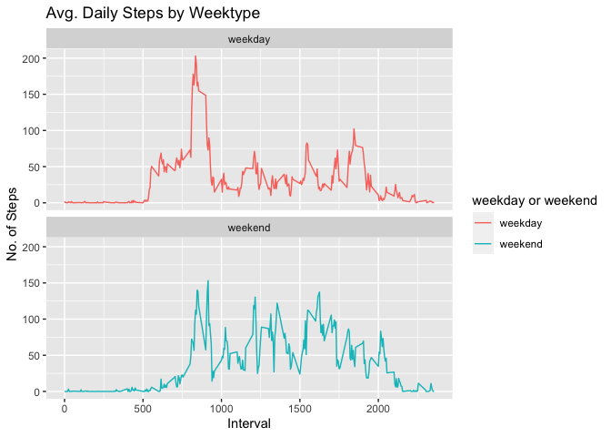

Loading and preprocessing the data
==================================

``` r
library(data.table)
library(ggplot2)

## Load dataset and unzip it
url <- "https://d396qusza40orc.cloudfront.net/repdata%2Fdata%2Factivity.zip"
download.file(url, destfile = paste(getwd(), "repdata.zip", sep = "/"), method = "curl")
unzip("repdata.zip")

## Read data. 
activityDT <- fread(input = "activity.csv")
```

What is mean total number of steps taken per day?
=================================================

### 1. Calculate the total number of steps taken per day

``` r
totalSteps <- aggregate(activityDT$steps, by=list(date=activityDT$date), FUN=sum)
head(totalSteps)
```

    ##         date     x
    ## 1 2012-10-01    NA
    ## 2 2012-10-02   126
    ## 3 2012-10-03 11352
    ## 4 2012-10-04 12116
    ## 5 2012-10-05 13294
    ## 6 2012-10-06 15420

### 2.Make a histogram of the total number of steps taken each day

``` r
hist(totalSteps$x,
     breaks=20,
     main="Histogram of Total Steps per day", 
     xlab="Steps")
```


### 3. Calculate and report the mean and median of the total number of steps taken per day

``` r
mean <- mean(totalSteps$x, na.rm = TRUE)
median <- median(totalSteps$x, na.rm = TRUE)
```

The mean total number of steps taken per day is 1.076618910^{4} and the median is 10765.

What is the average daily activity pattern?
===========================================

### 1. Make a time series plot (i.e. type = "l") of the 5-minute interval (x-axis) and the average number of steps taken, averaged across all days (y-axis)

``` r
intervalDT <- aggregate(activityDT$steps, by=list(interval=activityDT$interval), FUN=mean, na.rm=TRUE)
names(intervalDT)[2] <- "steps"

ggplot(intervalDT, aes(x = interval , y = steps)) + 
  geom_line(size=1) + 
  labs(title = "Average Daily Steps", x = "Interval", y = "Average Steps per day")
```


### 2. Which 5-minute interval, on average across all the days in the dataset, contains the maximum number of steps?

``` r
maxim <- intervalDT[intervalDT$steps == max(intervalDT$steps),]           
```

On average across all the days in the dataset, the 5-minute interval containing the maximum number of steps is 835, 206.1698113.

Imputing missing values
=======================

### 1. Calculate and report the total number of missing values in the dataset (i.e. the total number of rows with NAs)

``` r
nrow(activityDT[is.na(activityDT$steps),])
```

    ## [1] 2304

### 2. Devise a strategy for filling in all of the missing values in the dataset.

The strategy is to replace the NAs with the median in the interval time

``` r
activityDT[is.na(steps), "steps"] <- activityDT[, c(lapply(.SD, median, na.rm = TRUE)), .SDcols = c("steps")]
head(activityDT)
```

    ##    steps       date interval
    ## 1:     0 2012-10-01        0
    ## 2:     0 2012-10-01        5
    ## 3:     0 2012-10-01       10
    ## 4:     0 2012-10-01       15
    ## 5:     0 2012-10-01       20
    ## 6:     0 2012-10-01       25

### 3. Create a new dataset that is equal to the original dataset but with the missing data filled in.

``` r
fwrite(x = activityDT, file = "tidyData.csv", quote = FALSE)
```

### 4. Make a histogram of the total number of steps taken each day and calculate and report the mean and median total number of steps taken per day.

``` r
totalSteps <- aggregate(activityDT$steps, by=list(date=activityDT$date), FUN=sum)
hist(totalSteps$x,
     breaks=20,
     main="Histogram of Total Steps", 
     xlab="Steps")
```


``` r
mean <- mean(totalSteps$x, na.rm = TRUE)
median <- median(totalSteps$x, na.rm = TRUE)

mean 
```

    ## [1] 9354.23

``` r
median
```

    ## [1] 10395

Do these values differ from the estimates from the first part of the assignment?
================================================================================

What is the impact of imputing missing data on the estimates of the total daily number of steps?
================================================================================================

First Part (with na):
<br /> mean:10765
<br /> median:10765 <br />

<br /> Second Part (replacing na with median): <br /> mean:9354.23
<br /> median:10395

Are there differences in activity patterns between weekdays and weekends?
=========================================================================

### 1. Create a new factor variable in the dataset with two levels – “weekday” and “weekend” indicating whether a given date is a weekday or weekend day.

``` r
activityDT <- fread(input = "activity.csv")
activityDT[, date := as.POSIXct(date, format = "%Y-%m-%d")]
activityDT[, "Day of Week":= weekdays(x = date)]
activityDT[grepl(pattern = "Monday|Tuesday|Wednesday|Thursday|Friday", x = activityDT$`Day of Week`), "weekday or weekend"] <- "weekday"
activityDT[grepl(pattern = "Saturday|Sunday", x = activityDT$`Day of Week`), "weekday or weekend"] <- "weekend"
head(activityDT)
```

    ##    steps       date interval Day of Week weekday or weekend
    ## 1:    NA 2012-10-01        0      Monday            weekday
    ## 2:    NA 2012-10-01        5      Monday            weekday
    ## 3:    NA 2012-10-01       10      Monday            weekday
    ## 4:    NA 2012-10-01       15      Monday            weekday
    ## 5:    NA 2012-10-01       20      Monday            weekday
    ## 6:    NA 2012-10-01       25      Monday            weekday

### 2. Make a panel plot containing a time series plot (i.e. type = "l") of the 5-minute interval (x-axis) and the average number of steps taken, averaged across all weekday days or weekend days (y-axis).

``` r
activityDT[is.na(steps), "steps"] <- activityDT[, c(lapply(.SD, median, na.rm = TRUE)), .SDcols = c("steps")]
intervalDT <- aggregate(activityDT$steps, by=list(interval=activityDT$interval, "weekday or weekend"=activityDT$`weekday or weekend`), FUN=mean, na.rm=TRUE)
names(intervalDT)[3] <- "steps"

ggplot(intervalDT , aes(x = interval , y = steps, color=`weekday or weekend`)) + 
  geom_line() + 
  labs(title = "Avg. Daily Steps by Weektype", x = "Interval", y = "No. of Steps") +
  facet_wrap(~`weekday or weekend` , ncol = 1, nrow=2)
```


